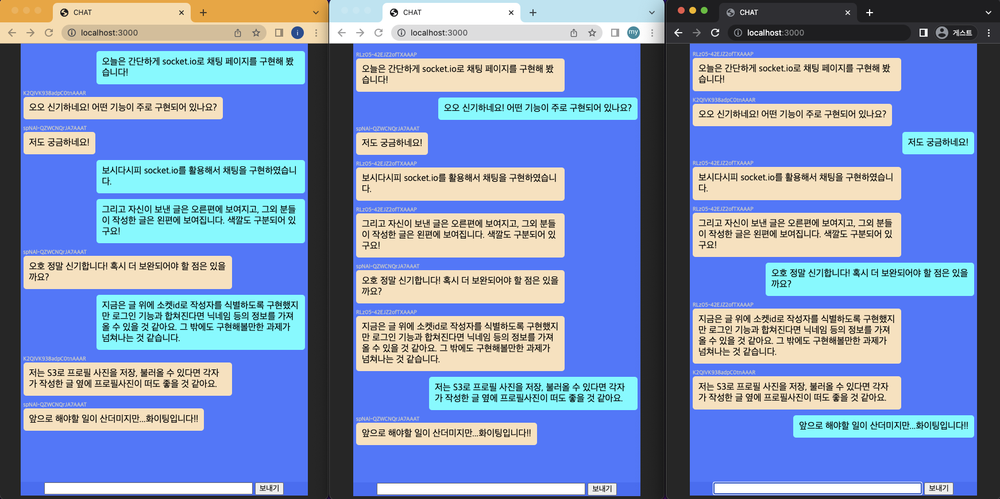
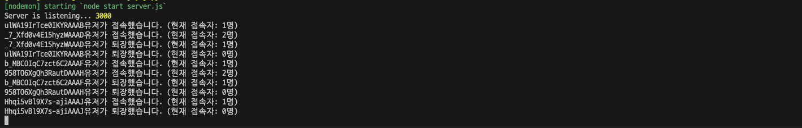

# socket.io를 활용한 미니 채팅 페이지

> 📌 socket.io 활용법을 배운 뒤 기본적인 채팅 기능만 넣어서 구현하는 개인 미니프로젝트의 결과물입니다.



## Workflow

> - 프론트에서 A 유저가 글을 보냅니다.
> - 본인의 socket.id와 작성한 글을 'SEND' 이벤트명으로 백엔드에 emit합니다. 이 때 본인이 작성한 글은 채팅창에서 푸른 바탕을 지니며 오른쪽 정렬되어 보여집니다.
> - 백엔드에서 'SEND' 이벤트를 받아 작성자(A)를 제외한 유저들을 대상으로 메시지와 socket.id 정보를 프론트에 전달합니다. 이 때 역시 'SEND'라는 동일한 이벤트명으로 전달합니다.
> - 프론트에서 'SEND' 이벤트를 받은 A외 유저들은 본인의 채팅창에 A가 작성한 문구가 노란 바탕으로 나타나며 왼쪽정렬된 상태로 받아집니다.
> - 본인이 작성한 문구 외 글들은 상단에 작성자의 socket.id가 보여집니다.

## Details

### socket.io를 위한 server.js의 기본 세팅

```javascript
//* server.js
// (...윗부분 생략)
const http = Server(app);
const io = socketIo(http, {
  cors: {
    origin: '*',
    methods: ['GET', 'POST'],
  },
});

let socketList = []; // 채팅에 접속한 모든 유저의 소켓을 보관

io.on('connection', (socket) => {
  socketList.push(socket);
  console.log(`${socket.id}유저가 접속했습니다. (현재 접속자: ${socketList.length}명)`);

  // 누군가 메시지를 등록하면 작성자 본인을 제외한 유저에게만 emit합니다.
  socket.on('SEND', (data) => {
    const { msg, user } = data;
    socketList.forEach((item) => {
      if (item !== socket) {
        item.emit('SEND', { msg, user });
      }
    });
  });

  // 유저가 페이지에서 나갈 경우 콘솔에 출력됩니다.
  socket.on('disconnect', function () {
    socketList.splice(socketList.indexOf(socket), 1);
    console.log(`${socket.id}유저가 퇴장했습니다. (현재 접속자: ${socketList.length}명)`);
  });
});

app.get('/', (req, res) => {
  res.render('index');
});

http.listen(PORT, HOST, () => {
  console.log('Server is listening...', PORT);
});
```

프론트에서 localhost:3000에 접속하면 socket.io를 통해 접속자의 socket정보를 socketList에 push합니다. 이를 통해 해당 페이지에 현재 접속 중인 유저가 몇 명인지 트래킹할 수 있습니다.  
  
루트 페이지 접속 시 index.ejs 파일로 이동합니다.

---

### 채팅창 프론트 구현

```html
<body>
  <div class="box">
    <div class="chat">
      <div id="msg"></div>
    </div>
    <div class="form-container">
      <form id="chat-form" onsubmit="return false">
        <input id="input-box" type="text" size="50" contenteditable="true" autocomplete="off" />
        <input type="submit" id="send-msg" value="보내기" />
      </form>
    </div>
  </div>
  <body></body>
</body>
```

msg의 id를 가지는 div 태그에 실제 작성된 글이 추가됩니다.

---

### 1. 발신자의 글 작성 및 보내기

```javascript
//* index.ejs의 script
function send() {
  const chat = $('.chat');
  const scrollHeight = chat.prop('scrollHeight');
  const msgText = $('#input-box');

  if (msgText === '') return;

  socket.emit('SEND', { msg: msgText.val(), user: socket.id });
  const msgLine = $('<div class="msgLine">');
  const msgBox = $('<div class="me">');

  msgBox.append(msgText.val());
  msgBox.css('display', 'inline-block');
  msgLine.css('text-align', 'right');
  msgLine.append(msgBox);

  $('#msg').append(msgLine);
  msgText.val('');
  chat.scrollTop(scrollHeight); // 보내기 완료 시 스크롤 최하단 이동
}
```

`보내기` 버튼을 클릭하거나 input창 작성 후 엔터키를 누르면 `send` 함수가 실행됩니다.  
함수가 실행되면 `socket.emit('SEND')`를 통해 텍스트와 소켓 아이디가 전달됩니다.  
이후 메시지를 감싸는 div태그(msgLine)와 메시지를 담을 div 태그(msgBox)를 생성합니다. 그래서 msgBox에 문구를 append하고, msgBox는 msgLine의 자식태그로 들어갑니다. 마지막으로 msgLine은 채팅창에 해당하는 msg 태그에 들어갑니다.  
정리하자면 작성된 문구를 백엔드에 전달한 뒤 여러 겹의 div태그에 담아서 본인의 채팅창에 노출하는 방식입니다. 여러 겹의 div 태그를 쓰는 이유는 문구 외 추가적인 정보(닉네임, 업로드 시간 등)를 별도로 추가하기 위함입니다.

---

### 2. 백엔드에서 받아 다시 프론트에 전달하기

```javascript
//* server.js
// 누군가 메시지를 등록하면 작성자 본인을 제외한 유저에게만 emit합니다.
socket.on('SEND', (data) => {
  const { msg, user } = data;
  socketList.forEach((item) => {
    if (item !== socket) {
      item.emit('SEND', { msg, user });
    }
  });
});
```

백엔드에서 특별한 처리는 없습니다. 단지 socket.id를 통해 작성자를 제외한 나머지 유저에게 정보를 전달하도록 하는 기능이 구현되어 있습니다. 이는 위 사진 예시와 같이 수신자와 발신자에게 보여지는 채팅창 구현 결과를 달리하기 위함입니다.

---

### 3. 프론트에서 수신자의 채팅창 구현

```javascript
//* index.ejs의 script
socket.on('SEND', (data) => {
  const { msg, user } = data;

  const msgLine = $('<div class="msgLine">');
  const userName = $('<div class="userName">');
  const msgBox = $('<div class="msgBox">');

  userName.append(user);
  msgLine.append(userName);

  msgBox.append(msg);
  msgBox.css('display', 'inline-block');
  msgLine.css('text-align', 'left');
  msgLine.append(msgBox);
  $('#msg').append(msgLine);
});
```

발신자 입장에서 동작한 send() 함수와 비슷하게 채팅창을 구현합니다. 단지 msgBox의 클래스명이 발신자는 "me"를 사용하지만 수신자는 "msgBox"를 사용한다는 점입니다. 이는 이전에 언급한 바와 같이 style을 달리하여 본인이 작성한 글은 오른쪽 정렬, 그 외 상대방이 작성한 글은 왼쪽정렬로 보여지도록 하기 위함입니다.  
또한 userName 태그를 추가하여 다수의 채팅에서 누가 어떤 글을 작성했는지 식별할 수 있도록 유저 이름(현재는 소켓 id)을 표기해 줍니다.
